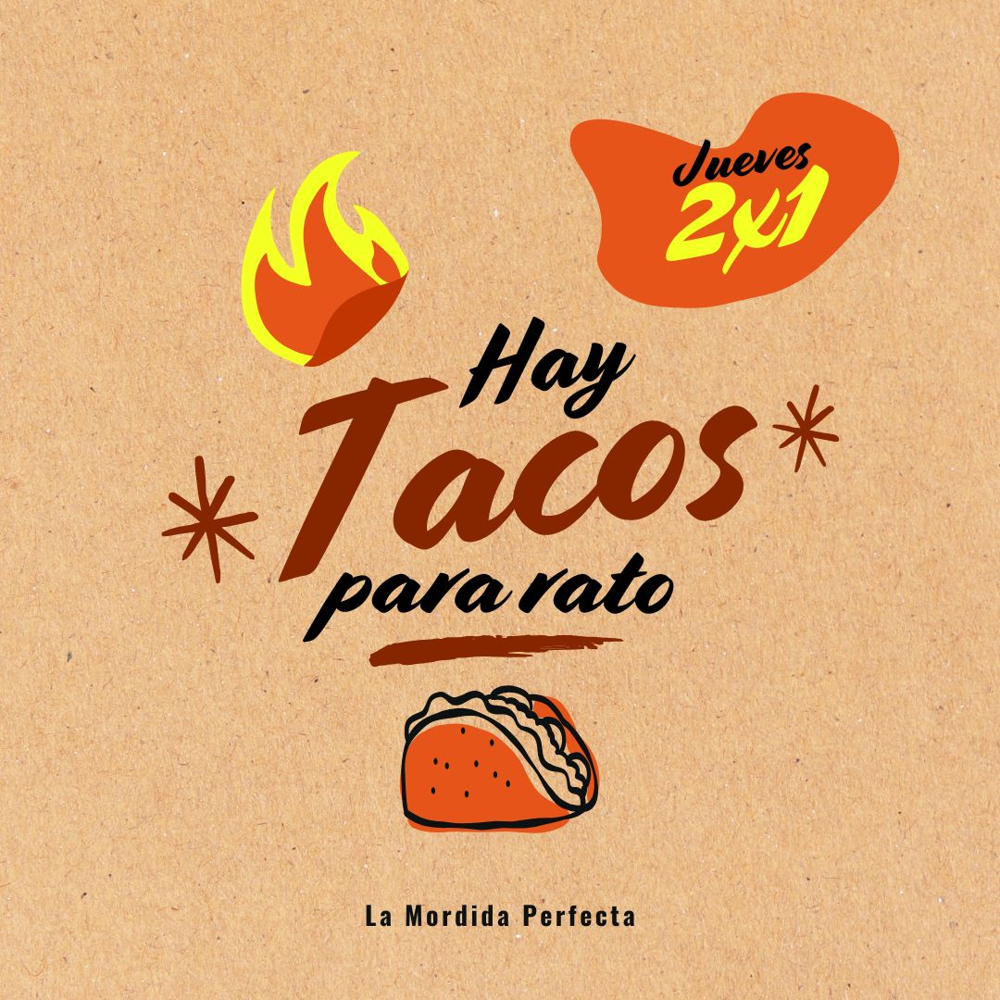
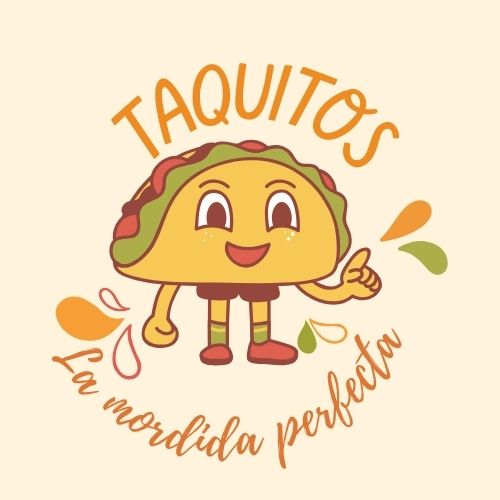
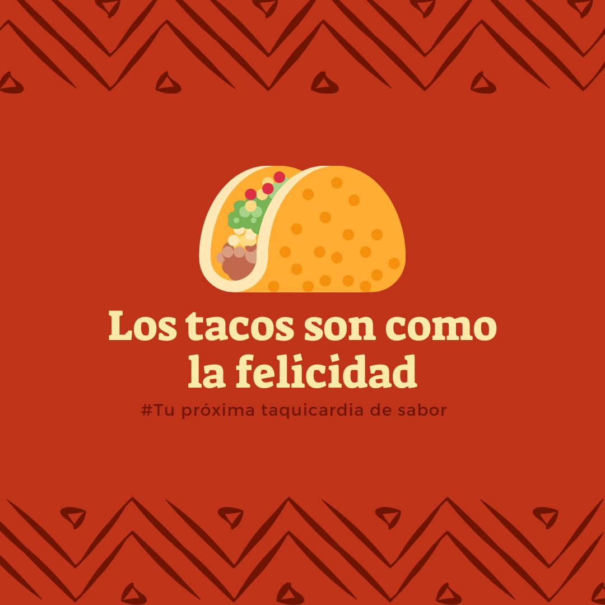

<html>
<head> 
	<meta charset="UTF-8">
    <meta name="viewport" content="width=device-width, initial-scale=1.0">
    <title>Taqueria la mordida Perfecta</title>
 
</head>
<body>
	

		<h1 > "Taqueria La Mordida Perfecta" </h1>
		<h2> -Tu próxima taquicardia de sabor-</h2>

	

	

		<a href="[[http://localhost/UV/men%C3%BA.html](https://140924130502.github.io/Proyecto_Karla/)](https://140924130502.github.io/men-/)"> Menú </a> 
		<a href="[http://localhost/UV/ubicaci%C3%B3n.html](https://140924130502.github.io/ubicaci-n/)"> Ubicación </a> 
		<a href="[http://localhost/UV/promociones.html](https://140924130502.github.io/ubicaci-n/)"> Promociones </a>
		<a href="[http://localhost/UV/men%C3%BA.html](https://140924130502.github.io/Proyecto_Karla/)" style="float:right"> Inicio</a>
	

	

		

			

				<h1> ¡¡ Promoción del Día!!</h1>
				<h3> Super Promoo </h3>
				

 
				

		

			
		

	

					<h2> Estas promociones y sabor no se encuentran en ninguna otra taqueria de la zona. </h2> 
				
 
				
 
					<h1> ¿ Quienes Somos? </h1>
					<h3>  Con sabor desde 2002 </h3>
		

			
		

					

 
					<h3> Somos un negocio pequeño que surgio en el estado de Veracruz, con el fin de deleitar el paladar de la gente Jarocha.</h3>
			
 
		

		

			

				

		

			
		

				

 

			
 

			
 
				<h1 text= "center"> Nuestras Redes</h1> 
			

		

			
		

				<h3 text= "center">¡ No olvides seguirnos en nuestras redes sociales!</h3>
				

			

		

	

	
 
		<h2>www.TaqueAMORdidaPerfecta.com</h2>
		<h2> Contacto: 2256-874-102</h2>
		<h2> Horario de atención</h2>
		<h3> Lun-Vie:   12:00 a  22:00</h3>
		<h3> Sab-Dom:   10:00 a  24:00</h3>
	

</body> 
</html>
